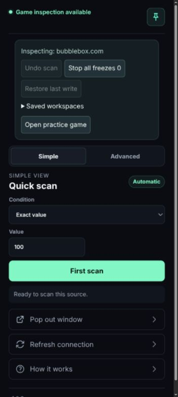
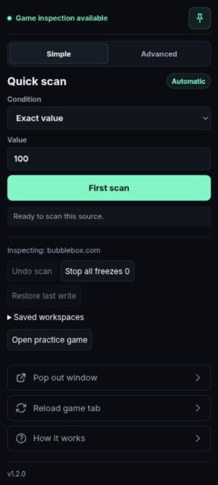
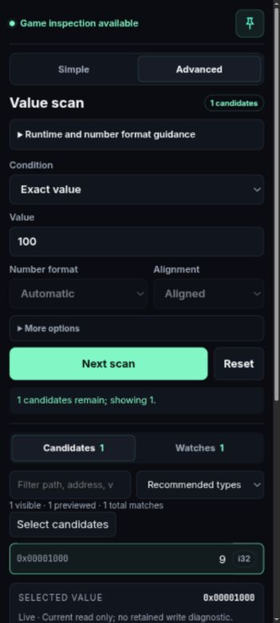

# Sidebar UX pass — 24 September 2026

Historical screenshots from the initial layout pass. Version 1.2.4 subsequently moved Undo between Scan and Reset, hid unavailable Undo, paired Condition/Value at 70/30, and removed Saved workspaces. See CHANGELOG.md for the final release scope.

Scope: layout, readability, and use of narrow sidebar space. Evidence comes from the current popup with the repository's simulated game connection, viewed in the Codex browser at approximately 360 CSS pixels wide.

1. **Open Simple view — improved.** Previously, workspace and recovery controls appeared before the scan, including unavailable actions. The scan now comes first; secondary tools follow it. The first scan button is about 220 px higher. The existing dark palette and mint primary action remain.

2. **Enter a value and scan — improved.** Exact-value input now fills the row when the maximum field is hidden. Form labels are 12 px and numeric controls are 14 px. Sidebar padding is reduced, duplicate view labels are removed, and the workspace tools use the existing palette. Scan and candidate selection were exercised with simulated values.

3. **Switch to Advanced and select a result — improved.** Runtime explanation is a native expandable disclosure. Results and editor appear closer to the scan controls. Selected value carries between views. Reload action now says “Reload game tab” to describe its actual effect.

Accessibility and limits: native labeled inputs, buttons, and disclosure controls remain. Larger control text and wrapping addresses reduce narrow-layout risks. This is not a screen-reader compliance audit. Browser-owned sidebar chrome, live game interaction, 200% zoom, and native Firefox/Chrome extension installation were not requalified in this pass. Recovery controls remain below the main workflow; selected frozen values retain their local Unfreeze action.

Validation: all 22 existing unit tests pass. Existing sidebar and toolbar browser harnesses pass. Firefox and Chromium release packages build and pass package validation. Simple and Advanced previews were checked at 300 CSS px with no horizontal page overflow. These checks use simulated extension APIs, not a newly installed native extension.
